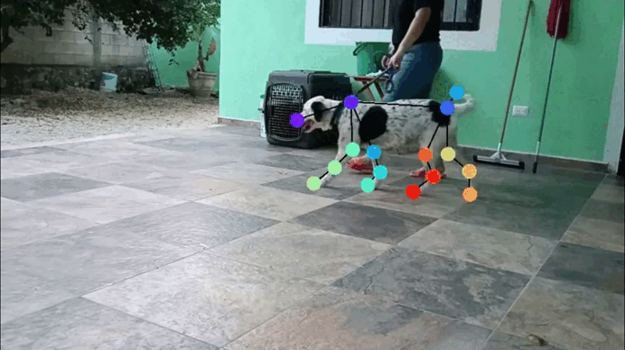
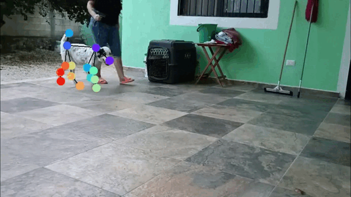
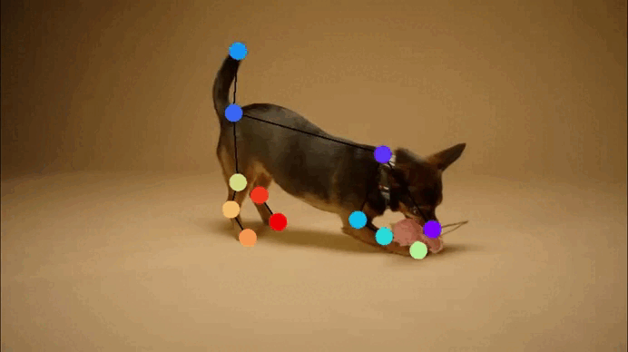
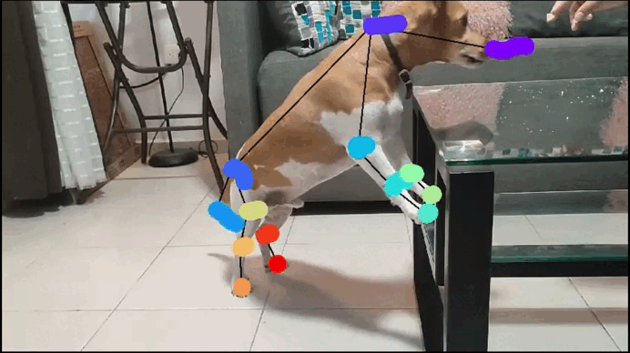

<div align="center">

  
  

  
  

  
  

</div>

<div align="center">
  
[📖 Contexto del estudio](#contexto-del-estudio) |
[🎥 Galería de experimentos](#galería-de-experimentos) |
[💡 Cómo funciona](#cómo-funciona) |
[🛠️ Requisitos](#requisitos) |
[🐛 Reportar problemas](https://github.com/TU_USUARIO/TU_REPO/issues) |
[📚 Créditos y atribuciones](#créditos-y-atribuciones) |
[📬 Contacto](#contacto)

</div>

<div align="center">

  <a href="https://www.python.org/"></a>
  <a href="https://flask.palletsprojects.com/"></a>
  <a href="https://deeplabcut.github.io/DeepLabCut/"></a>
  <a href="https://sleap.ai/"></a>
  <a href="https://numpy.org/"></a>
  <a href="https://pandas.pydata.org/"></a>
  <a href="https://joblib.readthedocs.io/"></a>
  <a href="https://pyyaml.org/wiki/PyYAMLDocumentation"></a>
  <a href="https://werkzeug.palletsprojects.com/"></a>
  
  <a href="https://www.ibm.com/es-es/think/topics/k-nearest-neighbors"></a>
  <a href="https://www.ibm.com/mx-es/think/topics/random-forest"></a>
  <a href="https://www.ibm.com/es-es/think/topics/decision-trees"></a>
  <a href="https://www.ibm.com/mx-es/think/topics/logistic-regression"></a>
  <a href="https://www.ibm.com/mx-es/think/topics/support-vector-machines"></a>
  <a href="https://www.ibm.com/mx-es/think/topics/naive-bayes"></a>

  <a href="https://www.pexels.com/video/close-up-view-of-a-cute-black-and-tan-short-coated-dog-7682696/"></a>

</div>

# ¡Bienvenido! 👋

**[PoseDoggo](https://github.com/galaxiahfast/WebAppDLC/blob/main/README.md)** es una aplicación web no oficial desarrollada en framework Flask que utiliza las funciones del software **[DeepLabCut](https://deeplabcut.github.io/DeepLabCut/README.html)** en Python e incorpora [aprendizaje automático](https://www.ibm.com/mx-es/think/topics/machine-learning) y [aprendizaje profundo](https://www.ibm.com/es-es/think/topics/deep-learning) para realizar análisis automático enfocándose en clasificar tres posturas corporales distintas (acostado, parado y erguido sobre las patas traseras) en perros mediante un entrenamiento para un solo animal, a través del procesamiento de videos de las razas **Setter Inglés**, **Chihuahua** y **Jack Russell Terrier** en entornos específicos.

[Lee más sobre el proyecto oficial de DeepLabCut aquí](https://github.com/DeepLabCut/DeepLabCut)

# Contexto del estudio

**[PoseDoggo](https://github.com/galaxiahfast/WebAppDLC/blob/main/README.md)** fue desarrollada como caso de estudio dentro de una tesis de licenciatura con el objetivo de demostrar cómo se puede lograr una integración funcional de programación orientada al **[aprendizaje automático](https://www.ibm.com/mx-es/think/topics/machine-learning)** y **[aprendizaje profundo](https://www.ibm.com/es-es/think/topics/deep-learning)** cuando se aplican al análisis de aspectos complejos de los comportamientos de perros, especialmente aquellos patrones de conducta que resultan difíciles de estudiar o que no podrían investigarse de manera efectiva mediante el uso de métodos cuantitativos tradicionales o enfoques experimentales convencionales en el campo de la **[etología](https://www.menteyciencia.com/etologia-que-es-y-cual-es-su-objeto-de-estudio/)** canina contemporánea.

Como parte del proceso de **[PoseDoggo](https://github.com/galaxiahfast/WebAppDLC/blob/main/README.md)**, se realizó un análisis comparativo entre las herramientas de software libre **[SLEAP (Social LEAP Estimates Animal Poses)](https://sleap.ai/)** y **[DeepLabCut (DLC)](https://deeplabcut.github.io/DeepLabCut/README.html)** con el objetivo de identificar la alternativa más adecuada para implementar la detección de posturas en los perros definidos para los tres experimentos descritos anteriormente. Los criterios de evaluación incluyeron los requerimientos de poder de cómputo, las necesidades de memoria para la ejecución en **GPU**, la facilidad de uso del sistema y la disponibilidad de documentación técnica, lo que condujo a la selección de **[DeepLabCut](https://deeplabcut.github.io/DeepLabCut/README.html)**. Es importante aclarar que esto no implica que una herramienta sea mejor que otra, sino que la seleccionada resultó más adecuado para los objetivos específicos de esta investigación.

A partir de esta selección surgió la idea del caso de estudio para desarrollar un análisis automático de poses en estos tres experimentos, mediante la creación de una interfaz web intuitiva que, a través de modificaciones específicas en el código de la aplicación, permitiera a los investigadores procesar y analizar videos de comportamiento canino sin requerir conocimientos avanzados de programación o configuraciones complejas de software especializado.

[Lee más sobre el proyecto oficial de SLEAP aquí](https://sleap.ai/)

# 📚 Referencias

La creación de **[PoseDoggo](https://github.com/galaxiahfast/WebAppDLC/blob/main/README.md)** para análisis de posturas caninas se sustenta en el uso de tecnologías avanzadas desarrolladas por terceros, lo que hace necesario reconocer apropiadamente el trabajo de otros investigadores mediante las citaciones correspondientes.

Se reconoce apropiadamente a los autores de las herramientas especializadas <a href="https://deeplabcut.github.io/DeepLabCut/README.html">DeepLabCut</a>, licenciada principalmente bajo la **GNU Lesser General Public License v3.0**, y a los creadores de <a href="https://sleap.ai/">SLEAP</a>, publicada bajo licencia **Clear BSD**, dado que ambas herramientas de código abierto han sido importantes para el desarrollo de esta investigación.

Para respetar los derechos de propiedad intelectual de sus desarrolladores, se presentan las siguientes citas bibliográficas.

```bibtex
@article{Mathisetal2018,
    title = {DeepLabCut: markerless pose estimation of user-defined body parts with deep learning},
    author = {Alexander Mathis and Pranav Mamidanna and Kevin M. Cury and Taiga Abe  and Venkatesh N. Murthy and Mackenzie W. Mathis and Matthias Bethge},
    journal = {Nature Neuroscience},
    year = {2018},
    url = {https://www.nature.com/articles/s41593-018-0209-y}}

@article{NathMathisetal2019,
    title = {Using DeepLabCut for 3D markerless pose estimation across species and behaviors},
    author = {Nath*, Tanmay and Mathis*, Alexander and Chen, An Chi and Patel, Amir and Bethge, Matthias and Mathis, Mackenzie W},
    journal = {Nature Protocols},
    year = {2019},
    url = {https://doi.org/10.1038/s41596-019-0176-0}}

@InProceedings{Mathis_2021_WACV,
    author = {Mathis, Alexander and Biasi, Thomas and Schneider, Steffen and Yuksekgonul, Mert and Rogers, Byron and Bethge, Matthias and Mathis, Mackenzie W.},
    title = {Pretraining Boosts Out-of-Domain Robustness for Pose Estimation},
    booktitle = {Proceedings of the IEEE/CVF Winter Conference on Applications of Computer Vision (WACV)},
    month = {January},
    year = {2021},
    pages = {1859-1868}}

@article{Lauer2022MultianimalPE,
    title = {Multi-animal pose estimation, identification and tracking with DeepLabCut},
    author = {Jessy Lauer and Mu Zhou and Shaokai Ye and William Menegas and Steffen Schneider and Tanmay Nath and Mohammed Mostafizur Rahman and Valentina Di Santo and Daniel Soberanes and Guoping Feng and Venkatesh N. Murthy and George Lauder and Catherine Dulac and M. Mathis and Alexander Mathis},
    journal = {Nature Methods},
    year = {2022},
    volume = {19},
    pages = {496 - 504}}

@article{Ye2024SuperAnimal,
    title = {SuperAnimal pretrained pose estimation models for behavioral analysis},
    author = {Shaokai Ye and Anastasiia Filippova and Jessy Lauer and Steffen Schneider and Maxime Vidal and and Tian Qiu and Alexander Mathis and Mackenzie W. Mathis},
    journal = {Nature Communications},
    year = {2024},
    volume = {15}}

@article{Mathis2020DeepLT,
    title = {Deep learning tools for the measurement of animal behavior in neuroscience},
    author = {Mackenzie W. Mathis and Alexander Mathis},
    journal = {Current Opinion in Neurobiology},
    year = {2020},
    volume = {60},
    pages = {1-11}}

@article{Mathis2020Primer,
    title = {A Primer on Motion Capture with Deep Learning: Principles, Pitfalls, and Perspectives},
    author = {Alexander Mathis and Steffen Schneider and Jessy Lauer and Mackenzie W. Mathis},
    journal = {Neuron},
    year = {2020},
    volume = {108},
    pages = {44-65}}

@article{MathisWarren2018speed,
    author = {Mathis, Alexander and Warren, Richard A.},
    title = {On the inference speed and video-compression robustness of DeepLabCut},
    year = {2018},
    doi = {10.1101/457242},
    publisher = {Cold Spring Harbor Laboratory},
    URL = {https://www.biorxiv.org/content/early/2018/10/30/457242},
    eprint = {https://www.biorxiv.org/content/early/2018/10/30/457242.full.pdf},
    journal = {bioRxiv}}

@article{Pereira2022sleap,
    title = {SLEAP: A deep learning system for multi-animal pose tracking},
    author = {Pereira, Talmo D and Tabris, Nathaniel and Matsliah, Arie and Turner, David M and Li, Junyu and Ravindranath, Shruthi and Papadoyannis, Eleni S and Normand, Edna and Deutsch, David S and Wang, Z. Yan and McKenzie-Smith, Grace C and Mitelut, Catalin C and Castro, Marielisa Diez and D'Uva, John and Kislin, Mikhail and Sanes, Dan H and Kocher, Sarah D and Samuel S-H and Falkner, Annegret L and Shaevitz, Joshua W and Murthy, Mala},
    journal = {Nature Methods},
    volume = {19},
    number = {4},
    year = {2022},
    publisher = {Nature Publishing Group}}
```

Se otorga el debido crédito al autor [KoolShooters](https://www.pexels.com/@koolshooters/) por el contenido visual de alta calidad disponible en la plataforma [Pexels](https://www.pexels.com/video/close-up-view-of-a-cute-black-and-tan-short-coated-dog-7682696/) bajo licencia libre de restricciones.

Se reconoce a [IBM](https://www.ibm.com/mx-es/) por sus materiales educativos sobre [aprendizaje automático](https://www.ibm.com/mx-es/think/topics/machine-learning) y [aprendizaje profundo](https://www.ibm.com/es-es/think/topics/deep-learning), contenidos que operan bajo las condiciones establecidas en el contrato **GSA ADP Schedule de IBM**, los cuales facilitan la comprensión de estas tecnologías avanzadas para investigadores, académicos o cualquier persona interesada en profundizar en el tema.

# ✨ Cómo citar este trabajo

Si este código, metodología o estructura han contribuido a tu proyecto académico, investigación o trabajo tecnológico, citar este repositorio como referencia no solo reconoce el esfuerzo invertido en su desarrollo, sino que también facilita a otros investigadores el acceso a herramientas útiles para sus propios proyectos.

A continuación se proporciona la cita en formato <a href="https://www.gnu.org/licenses/lgpl-3.0.en.html">BibTeX</a> (o **.bib**), que incluye todos los elementos bibliográficos necesarios para su correcta incorporación en documentos académicos o profesionales.

```bibtex
@bachelorsthesis{OrtizRivero2025Tesis,
  author       = {Ortiz Rivero, Julián Emiliano},
  title        = {Análisis semi-automático de movimiento canino en videos mediante las herramientas de DeepLabCut y SLEAP},
  school       = {Facultad de Matemáticas, Universidad Autónoma de Yucatán},
  year         = {2025},
  type         = {Tesis de Licenciatura},
  address      = {Mérida, Yucatán, México},
  url          = {https://github.com/galaxiahfast/WebAppDLC},
  note         = {Repositorio en línea del código asociado a la tesis},
}
```
Este proyecto fue realizado con fines académicos donde se busca contribuir a la divulgación científica haciendo que estas herramientas sean más accesibles para otros investigadores, por lo que se agradecerá cualquier mención, reconocimiento, colaboración futura o comentarios que puedan surgir de su uso.
