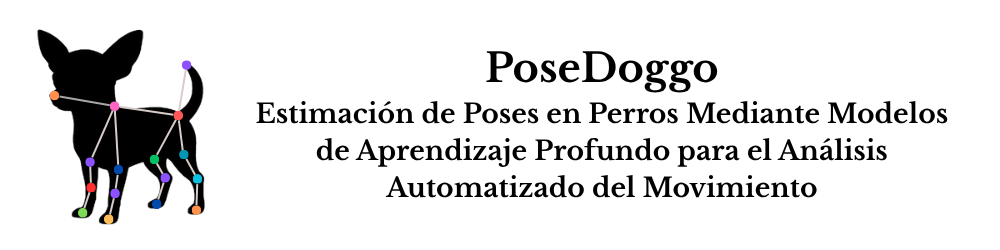
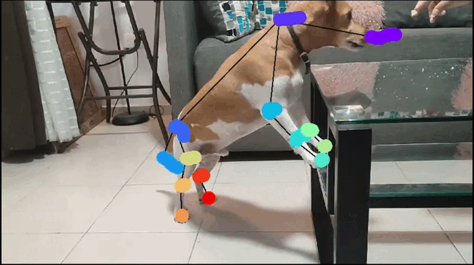

<div align="center">

  
  

  
  

  
  

</div>

<div align="center">
  
[📖 Contexto del estudio](#contexto-del-estudio) |
[🎥 Galería de experimentos](#galería-de-experimentos) |
[💡 Cómo funciona](#cómo-funciona) |
[🛠️ Requisitos](#requisitos) |
[🐛 Reportar problemas](https://github.com/TU_USUARIO/TU_REPO/issues) |
[📬 Contacto](#contacto)

</div>

<div align="center">

  <a href="https://www.python.org/"></a>
  <a href="https://flask.palletsprojects.com/"></a>
  <a href="https://deeplabcut.github.io/DeepLabCut/"></a>
  <a href="https://sleap.ai/"></a>
  <a href="https://numpy.org/"></a>
  <a href="https://pandas.pydata.org/"></a>
  <a href="https://joblib.readthedocs.io/"></a>
  <a href="https://pyyaml.org/wiki/PyYAMLDocumentation"></a>
  <a href="https://werkzeug.palletsprojects.com/"></a>
  <a href="https://www.ibm.com/es-es/think/topics/k-nearest-neighbors"></a>
  <a href="https://www.ibm.com/mx-es/think/topics/random-forest"></a>
  <a href="https://www.ibm.com/es-es/think/topics/decision-trees"></a>
  <a href="https://www.ibm.com/mx-es/think/topics/logistic-regression"></a>
  <a href="https://www.ibm.com/mx-es/think/topics/support-vector-machines"></a>
  <a href="https://www.ibm.com/mx-es/think/topics/naive-bayes"></a>
  <a href="https://www.pexels.com/video/close-up-view-of-a-cute-black-and-tan-short-coated-dog-7682696/"></a>

</div>

# ¡Bienvenido! 👋

**[PoseDoggo](https://github.com/galaxiahfast/WebAppDLC/blob/main/README.md)** es una aplicación web no oficial basada en el software **[DeepLabCut™️](https://deeplabcut.github.io/DeepLabCut/README.html)** que realiza análisis automático de posturas en perros mediante un entrenamiento para un solo animal, enfocándose en clasificar tres posturas corporales distintas (acostado, parado y erguido sobre las patas traseras) a través del procesamiento de videos de las razas **Setter Inglés**, **Chihuahua** y **Jack Russell Terrier** en entornos específicos.

[Lee más sobre el proyecto oficial de DeepLabCut aquí](https://github.com/DeepLabCut/DeepLabCut)

# Contexto del estudio

El desarrollo de esta aplicación web se realizó como caso de estudio para demostrar la integración funcional entre **[programación](https://www.w3schools.com/programming/prog_programming.php)**, **[aprendizaje automático](https://www.ibm.com/mx-es/think/topics/machine-learning)** y **[aprendizaje profundo](https://www.ibm.com/es-es/think/topics/deep-learning)** en el análisis de aspectos complejos del comportamiento canino que no podrían investigarse mediante métodos cuantitativos tradicionales.

Antes de tomar la decisión de crear este pequeño diseño web, se realizó una comparación con el software libre **[SLEAP™️](https://sleap.ai/)** (Social LEAP Estimates Animal Poses) para determinar la mejor opción para el desarrollo del análisis de poses en estos tres experimentos. Tras considerar factores como poder de cómputo, memoria requerida de la GPU, facilidad de uso e información disponible, se seleccionó **[DeepLabCut™️](https://deeplabcut.github.io/DeepLabCut/README.html)**. Esto no implica que uno sea mejor que otro, sino que para esta investigación específica **[DLC™️](https://deeplabcut.github.io/DeepLabCut/README.html)** resultó más adecuado.

[Lee más sobre el proyecto oficial de SLEAP aquí](https://sleap.ai/)


## Créditos y atribuciones

Este proyecto hace uso de tecnologías, contenidos académicos y recursos visuales que no son de autoría propia; por tanto, con el fin de respetar el trabajo intelectual y ético que sustenta a las plataformas científicas utilizadas, se citan los artículos originales que documentan el desarrollo, validación y evolución de **DeepLabCut™️** y **SLEAP™️**, los cuales constituyen los pilares fundamentales de esta herramienta web. Asimismo, se reconocen públicamente los artículos científicos que describen las capacidades técnicas, avances recientes y aplicaciones experimentales de ambos sistemas, cuyas referencias completas se presentan a continuación; estas publicaciones son esenciales para comprender tanto los fundamentos metodológicos como las perspectivas futuras del análisis automatizado del comportamiento animal mediante aprendizaje profundo.

También se han incorporado recursos visuales como el siguiente [video de un perro en alta resolución](https://www.pexels.com/video/close-up-view-of-a-cute-black-and-tan-short-coated-dog-7682696/) del autor [KoolShooters](https://www.pexels.com/@koolshooters/), ofrecido bajo licencia libre a través de Pexels, y se han utilizado materiales educativos disponibles en línea, como los artículos de IBM sobre [aprendizaje automático](https://www.ibm.com/mx-es/think/topics/machine-learning) y [aprendizaje profundo](https://www.ibm.com/es-es/think/topics/deep-learning), con el propósito de facilitar una mejor comprensión para el público general interesado en estas tecnologías.

### Citaciones relevantes

```bibtex
@article{Mathisetal2018,
    title = {DeepLabCut: markerless pose estimation of user-defined body parts with deep learning},
    author = {Alexander Mathis and Pranav Mamidanna and Kevin M. Cury and Taiga Abe  and Venkatesh N. Murthy and Mackenzie W. Mathis and Matthias Bethge},
    journal = {Nature Neuroscience},
    year = {2018},
    url = {https://www.nature.com/articles/s41593-018-0209-y}}

@article{NathMathisetal2019,
    title = {Using DeepLabCut for 3D markerless pose estimation across species and behaviors},
    author = {Nath*, Tanmay and Mathis*, Alexander and Chen, An Chi and Patel, Amir and Bethge, Matthias and Mathis, Mackenzie W},
    journal = {Nature Protocols},
    year = {2019},
    url = {https://doi.org/10.1038/s41596-019-0176-0}}

@InProceedings{Mathis_2021_WACV,
    author = {Mathis, Alexander and Biasi, Thomas and Schneider, Steffen and Yuksekgonul, Mert and Rogers, Byron and Bethge, Matthias and Mathis, Mackenzie W.},
    title = {Pretraining Boosts Out-of-Domain Robustness for Pose Estimation},
    booktitle = {Proceedings of the IEEE/CVF Winter Conference on Applications of Computer Vision (WACV)},
    month = {January},
    year = {2021},
    pages = {1859-1868}}

@article{Lauer2022MultianimalPE,
    title = {Multi-animal pose estimation, identification and tracking with DeepLabCut},
    author = {Jessy Lauer and Mu Zhou and Shaokai Ye and William Menegas and Steffen Schneider and Tanmay Nath and Mohammed Mostafizur Rahman and Valentina Di Santo and Daniel Soberanes and Guoping Feng and Venkatesh N. Murthy and George Lauder and Catherine Dulac and M. Mathis and Alexander Mathis},
    journal = {Nature Methods},
    year = {2022},
    volume = {19},
    pages = {496 - 504}}

@article{Ye2024SuperAnimal,
    title = {SuperAnimal pretrained pose estimation models for behavioral analysis},
    author = {Shaokai Ye and Anastasiia Filippova and Jessy Lauer and Steffen Schneider and Maxime Vidal and and Tian Qiu and Alexander Mathis and Mackenzie W. Mathis},
    journal = {Nature Communications},
    year = {2024},
    volume = {15}}

@article{Mathis2020DeepLT,
    title = {Deep learning tools for the measurement of animal behavior in neuroscience},
    author = {Mackenzie W. Mathis and Alexander Mathis},
    journal = {Current Opinion in Neurobiology},
    year = {2020},
    volume = {60},
    pages = {1-11}}

@article{Mathis2020Primer,
    title = {A Primer on Motion Capture with Deep Learning: Principles, Pitfalls, and Perspectives},
    author = {Alexander Mathis and Steffen Schneider and Jessy Lauer and Mackenzie W. Mathis},
    journal = {Neuron},
    year = {2020},
    volume = {108},
    pages = {44-65}}

@article{MathisWarren2018speed,
    author = {Mathis, Alexander and Warren, Richard A.},
    title = {On the inference speed and video-compression robustness of DeepLabCut},
    year = {2018},
    doi = {10.1101/457242},
    publisher = {Cold Spring Harbor Laboratory},
    URL = {https://www.biorxiv.org/content/early/2018/10/30/457242},
    eprint = {https://www.biorxiv.org/content/early/2018/10/30/457242.full.pdf},
    journal = {bioRxiv}}

@article{Pereira2022sleap,
    title = {SLEAP: A deep learning system for multi-animal pose tracking},
    author = {Pereira, Talmo D and Tabris, Nathaniel and Matsliah, Arie and Turner, David M and Li, Junyu and Ravindranath, Shruthi and Papadoyannis, Eleni S and Normand, Edna and Deutsch, David S and Wang, Z. Yan and McKenzie-Smith, Grace C and Mitelut, Catalin C and Castro, Marielisa Diez and D'Uva, John and Kislin, Mikhail and Sanes, Dan H and Kocher, Sarah D and Samuel S-H and Falkner, Annegret L and Shaevitz, Joshua W and Murthy, Mala},
    journal = {Nature Methods},
    volume = {19},
    number = {4},
    year = {2022},
    publisher = {Nature Publishing Group}}
